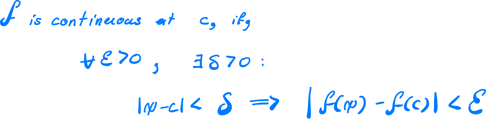
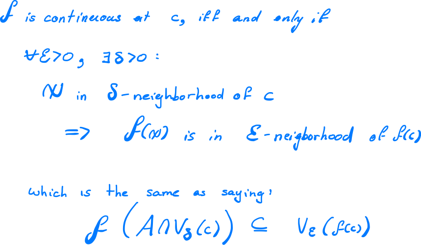
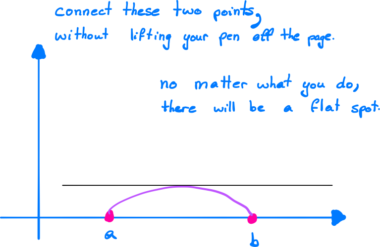
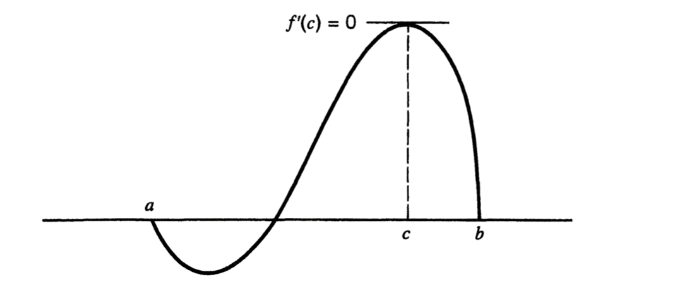
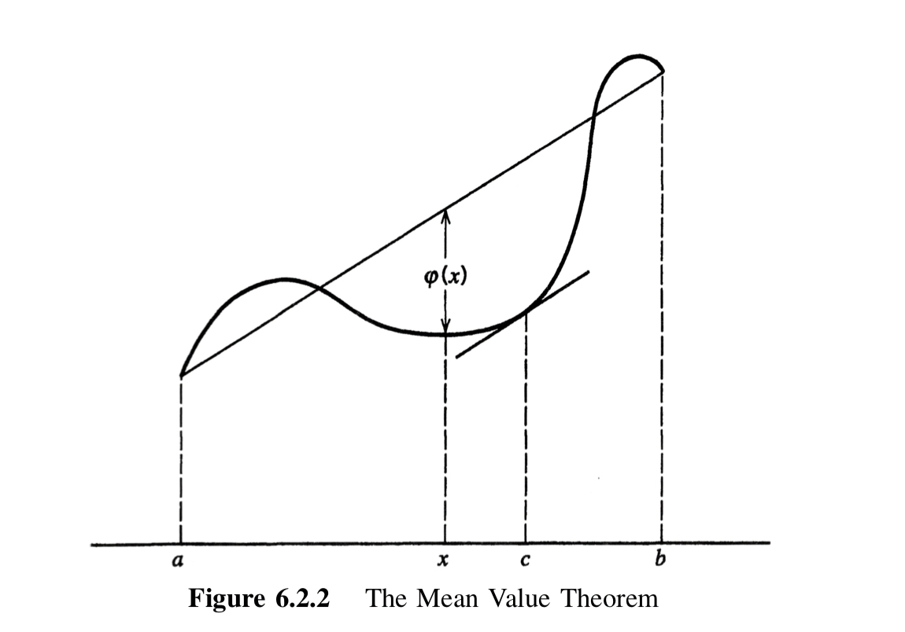

# (05) Continuity

Wk 4 Material; Topic 3; Due 28 March

[TOC]

## Continuous Functions [5.1]

### Definition of Continuity

Take some function $f: A \rightarrow B​$  where $A \subseteq \mathbb{R}​$:

* the function $f$ is said to be continuous at some point $c\in A$ if and only if $\lim_{x\rightarrow c} = f(c)$

#### Rigorous Definition

So let's phrase that using the $\varepsilon$-$\delta$ definition of the limit:

##### In Terms of Neighborhoods
This can be expressed in terms of neighborhoods:

#### Conditions for Continuity
If $c​$ is a cluster point of $A​$, then trhee conditions must hold for $f​$ to be continuous at $c​$, that is to say that three conditions must hold for $\lim_{x\rightarrow c} = f(c)​$:
1. $f$ must be defined at $c$ 
   * so that $f(c)$ actually has meaning
2. The limit of $f$ at $c$ must exist in $\mathbb{R}$ so that
   *  $\lim_{x\rightarrow c}$ actually has a meaning
3. These two values are equal
   * $\lim_{x\rightarrow c} = f(c)$

> ***Cluster Points***
>
> A cluster point has infinitely divisible values either side of it, if a value is not a cluster point it's just an isolated point and it is said to be continuous at that point, so generally we just assume points are cluster points because if they're not then they're automatically continuous and so not very interesting.

### Sequential Criterion for Continuity [5.1.3]

Just like a limits can be defined in terms of sequences (at (4.1.8) of the TB),  continuity can hence be defined in terms of sequences:

A function $f: A \rightarrow \mathbb{R}$ is continuous at some point $c \in A $ if and only if:

*  for every sequence $(x_n)$ in $A$ that converges to $c$
  * $f\left(\left( x_n \right) \right)$ converges to $c$ 

#### Discontinuity Criterion [5.1.4]

Just like limits can have divergence criteria in terms of limits, so can the continuity definition, this is analogous to the *Limit Divergence Criteria* at (4.1.9(a) of the TB).

A function $f: A \rightarrow \mathbb{R}$ is **discontinuous** at some point $c \in A $ if and only if:

-  there exists some sequence $(x_n)$ in $A$ that converges to $c​$:
  - $f\left(\left( x_n \right) \right)$ **does note* converge to $c$ 

##### Example

$\lim_{x\rightarrow 0} \sin(\frac{1}{x^2})$  is undefined, so a sequence that converges to 0 does is such that $f\left(\left( x_n \right) \right)$ **does note* converge to $c$ and so by (5.1.4) we can conclude that the function is discontinuous at 0.

### Set Continuity

if $B$ is a subset of $A$ we can say that the function $f: A \rightarrow B $ is continuous on $B$ if it is continuous at every point on $B$.

### Defining a function to overcome Discontinuity

So take a function that is discontinuous, e.g. $\enspace f(x) = \frac{x^2-1^2}{(x+1)\cdot (x-1)}$ is discontinuous at $x = \pm 1$, to overcome this we can define a anew function $g(x)$:
$$
 g(x) = 
  \begin{cases}
    f\left( x \right) , \enspace
   x\neq \pm1\\ 
   1\quad \enspace \enspace  , \enspace   x = \pm 1\\
      \end{cases}
$$
This function will be continuous because the 'hole' is more or less 'plugged' by a given value.

* if there is no limit value at the discontinuity, then obviously this method won't work because we have no value with which to 'plug' the 'hole'

## Combinations of Continuous Functions [5.2]

### Absolute Values Preserve Continuity (5.2.4)

Take our function $f: A \rightarrow B$ and define the absolute function as :

* $\text{abs}(f)(x) = \left| f \right|(x) := \left| f(x) \right| \qquad\forall x \in A​$  
  * If $f$ is continuous at $c$, then $\left| f(x) \right|$ is continuous at $c$ 
  * If $f$ is continuous on $A$, then $\left| f(x) \right|$ is continuous on $A$ 

### Square Roots Preserve Continuity

Take our function $f: A \rightarrow B​$ and define the square root function as :

- $\text{sqrt}(f)(x) = \left(\sqrt{(f)}\right) \left(x\right) := \sqrt{f(x)} \qquad\forall x \in A​$  
  - If $f$ is continuous at $c$, then $ \left(\sqrt{(f)}\right) \left(x\right)$ is continuous at $c$ 
  - If $f$ is continuous on $A$, then $ \left(\sqrt{(f)}\right) \left(x\right)$ is continuous on $A$ 

### Compositions Preserve Continuity

Let:

*  $A, B \subseteq R$ 
  * $f: A \rightarrow B$ 
  *  $g: B\rightarrow \mathbb{R}$
    * $f(A) \subseteq \mathbb{R}$ 

If $f​$ is continuous at $c​$ and $g​$ continuous at $f(c)​$ then $g\left( f\left( x\right) \right) = \left(g \circ f \right): A \rightarrow \mathbb{R}​$ is continuous at $c​$    

If $f$ is continuous on $A$ and $g$ continuous on $B$ then  $g\left( f\left( x\right) \right) = \left(g \circ f \right): A \rightarrow \mathbb{R}$ is continuous on $A$

## Continuous Functions on Intervals [5.3]

These weren't in the lecture Notes, they're probably not too important.

## Uniform continuity [5.4]

These weren't in the lecture Notes, they're probably not too important.

## The Mean Value Theorem [6.2]

### Maximum / Minimum [6.2.0]

Take some function $f: I \rightarrow \mathbb{R}$ 

* $f​$ has a relative **maximum** if there exists some neighbourhood $V:=V_{\delta}\left( c \right)​$ such that::
  * $f(x) \geq f(c) \quad \forall x \in \left( V\cap I \right)$
* $f$ has a relative **minimum** if there exists some neighbourhood $V:=V_{\delta}\left( c \right)$ such that:
  - $f(x) \leq f(c) \quad \forall x \in \left( V\cap I \right)$

If either of these are satisfied then $f$ is said to have a **relative extrema** 

### Interior Extrema Theorem [6.2.1]

let $c$ be a point on some interval $I$ at which $f$ has a max/min

* If there is a derivative at $c$ then it must be 0:
  * $c$ is a point of at which $f$ has a *relative extremum* $\implies$ $f^{\prime}(c)=0$
* The derivative at $c​$ must be 0 or must be undefined.
  * $f'(c) = 0 \vee f'(c) \in \emptyset​$
  * $f'(c) = 0 \vee f'(c) \downarrow$

In *Computability: An Introduction to Recursion Theory* [^1 ] the $\downarrow$ symbol is said to mean undefined, it's a useful notation so I've adopted it, $\in \emptyset$ is potentially another technique as well.

[^1]: Undefined (Mathematics), https://en.wikipedia.org/wiki/Undefined_%28mathematics%29

### Rolle's Theorem [6.2.3]

Suppose that:

*  $f$ is continuous on $I:= [a,b]$

* $f'$ exists at every point of the open interval $(a,b)$
* $f(a) = f(b) = 0​$

Then there must exist some value $c$ such that $f'(c) = 0$ 

* This is the same as saying there must be a point of relative extrema (by the *Interior Extrema Theorem*)

### Mean Value Theorem [6.2.4] 

This is basically a built up version of Rolle's Theorem,

Suppose that:

- $f$ is continuous on $I:= [a,b]$
- $f'$ exists at every point of the open interval $(a,b)$

Then, there must exist some $c$:
$$
f'\left( c \right) = \frac{f\left( b \right)-f\left( a \right)}{b-a} \\
\implies  \left( b-a \right) \cdot f\left( c \right) = f\left( b \right) - f\left( a \right)
$$

## L'Hospital's Rules

### Cauchy Mean Value Theorem
let $f$ and $g$ be:
* Continuous on [a,b]

* Differentiable on (a,b)

if $g'(x)  \neq 0$ , then $\exists c \in (a,b)$ :

$$
\frac{f\left( b \right)-f\left( a \right)}{g\left( b \right) - g\left( a \right)} = \frac{f'\left( c \right)}{g'\left( c \right)}
$$

#### Restrictions

By *Rolle's Theorem*, if $g'(x) \neq 0$, then $g(a) \neq g(b)$.

##### Creating a stricter restriction

Let's suppose for some reason you needed to create the restriction:

* $g'(x) \neq 0$, and
* $g(a) \neq g(b)$ 

An equivalent restriction would be:
$$
\left( f'\left( x \right) \right)^{2} + \left( g'\left( x \right) \right)^{2} \neq 0
$$

